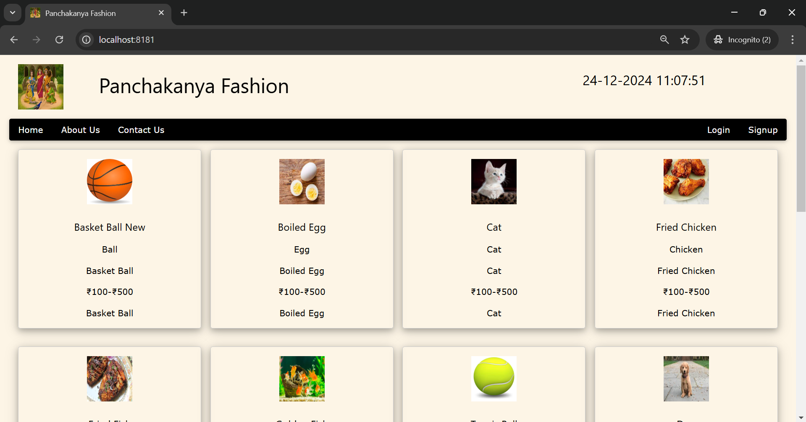
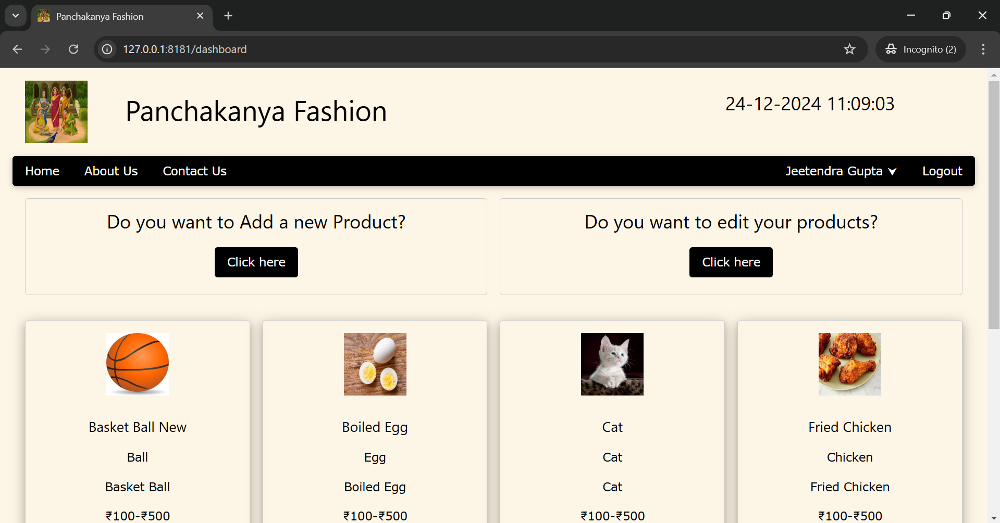

# Panchakanya Fashion - Web Application

## Overview

Panchakanya Fashion is a web application built using Flask, allowing users to sign up, log in, manage their products, and upload product images. It features secure authentication, product management (create, update, delete), and a simple dashboard for users to view and manage their product listings.

## Features

- User Registration and Login
- Product Management:
  - Add new products with image upload
  - Update product details
  - Delete products
- User Dashboard to view and manage products
- Session management for user login state
- Secure password handling using hashing
- Logging for actions like registration, login, and product updates

## Prerequisites

Before running the application, make sure you have the following installed:

- Python 3.6 or higher
- Flask
- SQLAlchemy (for ORM-based database interaction)
- SQLite (default database used in this app)

## Installation

1. Clone the repository:

   ```bash
   git clone https://github.com/jeetendra29gupta/flask_simple_ecommerce.git
   cd flask_simple_ecommerce
   ```

2. Create a virtual environment:

   ```bash
   python -m venv venv
   ```

3. Activate the virtual environment:
   - On Windows:

     ```bash
     venv\Scripts\activate
     ```

   - On Mac/Linux:

     ```bash
     source venv/bin/activate
     ```

4. Install dependencies:

   ```bash
   pip install -r requirements.txt
   ```

## Configuration

The app uses SQLite as its database. You can configure the database URL in the `models.py` file.

### Environment Variables

Set the following environment variable for security and session management:

- `FLASK_SECRET_KEY`: A random secret key for Flask sessions and CSRF protection (can be generated using `secrets.token_hex(16)`).
- `SESSION_TYPE`: 'filesystem' (default) for storing sessions in files.
- `UPLOAD_FOLDER`: Directory where uploaded images will be stored (default is `static/images`).

## Running the Application

To start the application, run:

```bash
python main_app.py
```

The app will run on `http://127.0.0.1:8181` by default. You can access it through your web browser.

## Routes

- `/` - Home page, displays the list of products.
- `/signup` - Sign up for a new account.
- `/login` - Login to the application.
- `/logout` - Log out of the application.
- `/dashboard` - User dashboard to manage your products.
- `/add_product` - Add a new product.
- `/edit_product` - Edit existing products.
- `/update_product/<product_id>` - Update a specific product's details.
- `/delete_product/<product_id>` - Delete a product.

## File Upload

Products can include images. Supported image file types include:

- PNG
- JPG
- JPEG
- GIF

Images are saved in the `static/images` directory.

## Database Schema

The application uses the following models:

- **User**: Stores user information such as `id`, `username`, `email`, `password`, and `fullname`.
- **Product**: Stores product information such as `id`, `name`, `category`, `description`, `price_range`, `comments`, `filename` (for image), and `user_id` (foreign key referencing the User model).

## Logging

The application logs significant actions, such as user registration, login, and product changes, to a file called `app.log`.

---

## Screenshot


___